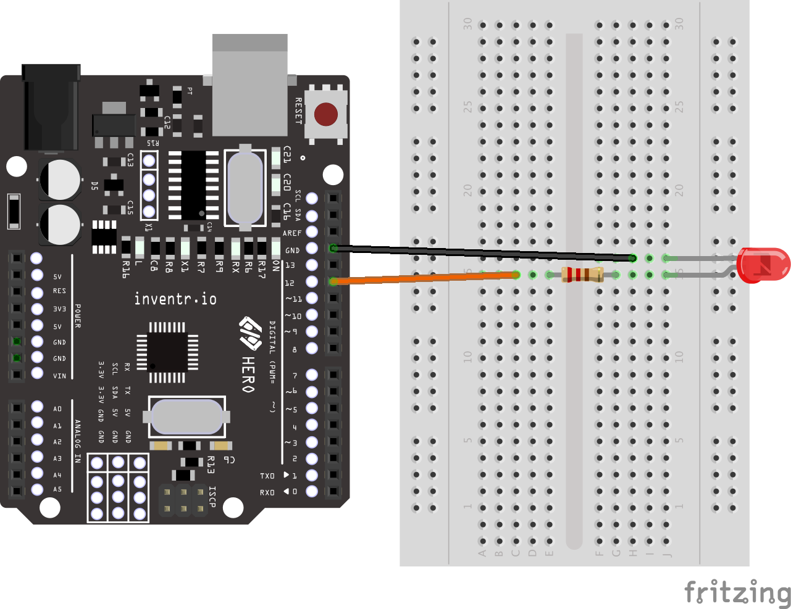

# Day 2 - "It's Really Dark In Here..."


[](https://www.youtube.com/watch?v=0IulLD1Q1ZM&list=PL-ykYLZSERMSZFH8_4zQx4BMWpt4aG1kr&index=2)

## Story Synopsis:

Placeholder example: After Just getting your power systems back online and a light to see again, you need to look for a way to save that last bit of remaining battery power remaining until you can deploy the solar panels.... or else it's game over!:

Comic-Style Graphic: <br>


## Code-Snippet
```
  int Light = 12; // The HERO Board Pin that the LED is wired to

  void setup() {
    // initialize digital pin LED_BUILTIN as an output.
    pinMode(Light, OUTPUT);
    digitalWrite(Light, HIGH);
  }
```

### Wiring Diagram:
| Arduino | LED |
| --- | --- |
| 12 | Long Wire |
| GND | Short Wire |



### Installation
No libraries or includes required.
