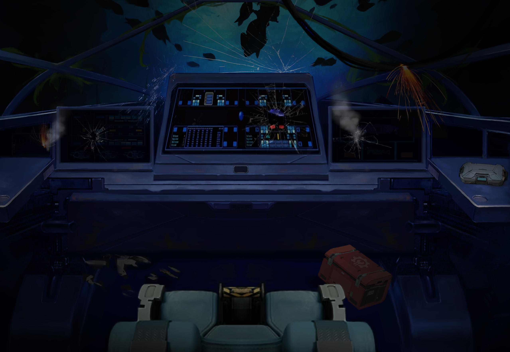

# Day 01 - "Incoming Broadcast from InventrCorp"


<p align="center">
    <br>
    <i>Disaster strikes as you crash land on an unknown planet</i>
</p>

## The Story So Far..
You have crash landed on an unknown planet and now you need to activate and fly your ancient rescue craft to safety. Play the video below to discover how this is going to be possible and learn to take your first steps in this challenging mission. If you want an overview of what your will be doing today, you can read the "Day 1 Activity" section below this video.


[](https://www.youtube.com/watch?v=faVBaH7iDV0&list=PL-ykYLZSERMSZFH8_4zQx4BMWpt4aG1kr&index=1&t=2s)


## Day 1 Activity
An AI from rescue shuttle control will attempt to guide you through the process of activating and flying your rescue craft to safety. Your rescue shuttle is operated using primitive 21st century computers and electronics, including a device called a Hero which can communicate with your computer using a USB cable and is controlled by Arduino software. Our plan is to build electronic systems and computer code that will operate them to get your shuttle flying. We will start out simple with small steps and add new features and knowledge each day. Today we will test out our ability to command the Hero and have it blink some of its onboard lights.

First, you download the Arduino IDE onto your computer and connect the HERO board (which is based on the Arduino Uno) to your computer using a Type B USB Cable. Then, you access the built in sketch called Blink and upload it to the HERO board. You learn about how the code is structured, with its setup() function and loop() function. You learn that the pinMode() function can be used to set up a digital pin on the HERO board as an OUTPUT, and that the digitalWrite() function can set the pin to be a HIGH or LOW voltage. The delay() function is used to get the program to wait for a specified number of milliseconds before it continues with the next command. You learn how to compile and upload the sketch to the HERO board in order to run it. Finally, you modify the code to change the amount of time that the LED is expected to be on and off.

You have succeeded in getting your Hero up and running and communicating with your ships computer. Tomorrow we will start learning more about electronic circuits and computer code and on your way to get you flying off the planet.

## Hardware Required:

You attach your computer/laptop/MAC/chromebook or linux machine to the HERO board using a Type B USB Cable

<p align="center">
    
</p>

## Code Used
The Blink sketch found in your Arduino IDE. Here is a copy of it:
```

/* Blink

  Turns an LED on for one second, then off for one second, repeatedly. 

  Most Arduinos have an on-board LED you can control. 
  On the UNO, MEGA and ZERO it is attached to digital pin 13, on MKR1000 on pin 6. 
  LED_BUILTIN is set to the correct LED pin independent of which board is used.
*/

// the setup function runs once when you press reset or power the board
void setup() {
  // initialize digital pin LED_BUILTIN as an output.
  pinMode(LED_BUILTIN, OUTPUT);
}

// the loop function runs over and over again forever
void loop() {
  digitalWrite(LED_BUILTIN, HIGH);  // turn the LED on (HIGH is the voltage level)
  delay(1000);                      // wait for a second
  digitalWrite(LED_BUILTIN, LOW);   // turn the LED off by making the voltage LOW
  delay(1000);                      // wait for a second
}

```
## Installation
No libraries or includes required.

---
## <center><b>Key Learning for Day 1</b></center>

---
| Key learning introduced in Day 1 | Example of code / Further instructions|
| :--- | :--- |
| How to download the Arduino IDE for your computer (IDE stands for Integrated Development Environment)	| [Download the Arduino IDE](https://www.arduino.cc/en/software)| 
|How to connect the Hero board to the computer using a Type B USB Cable and select the correct board and port in the IDE window 	Tools>Board>Arduino AVR Boards>Arduino Uno | Tools>Port>COM3 (Arduino Uno) |
| How to access the built-in sketch called Blink available within the IDE. The Blink program causes the on-board light to link on and off | File>Examples>01.Basics>Blink |
| A [setup() function](https://www.arduino.cc/reference/en/language/structure/sketch/setup/) runs once when you press reset or power the board (the void datatype for the setup() function indicates that the function is not expected to return any information when it is run) | void setup() { <br>&nbsp;&nbsp;// put your setup code here, to run once:<br>} |
| A [loop() function](https://www.arduino.cc/reference/en/language/structure/sketch/loop/) runs repeatedly until you press reset or power down the board. (the void datatype for the loop() function indicates that the function is not expected to return any information when it is run) | void loop() { <br>&nbsp;&nbsp;// put your main code here, to run repeatedly: <br>} |
| [pinMode command](https://www.arduino.cc/reference/en/language/functions/digital-io/pinmode/) is a built-in function of the Hero and is used to initialize a digital pin as an [OUTPUT](https://www.arduino.cc/reference/en/language/variables/constants/constants/), in this case, pin 13 which is also given the name [LED_BUILTIN](https://www.arduino.cc/reference/en/language/variables/constants/constants/). This is used within the setup() function | pinMode(LED_BUILTIN, OUTPUT); or pinMode(13, OUTPUT); (later we will learn about initializing a pin as an INPUT) 
| The [digitalWrite() function](https://www.arduino.cc/reference/en/language/functions/digital-io/digitalwrite/) tells a pin to do something. This is used within the loop() function. Find out more about [HIGH/LOW constant variables](https://www.arduino.cc/reference/en/language/variables/constants/constants/) | digitalWrite(LED_BUILTIN, HIGH); or digitalWrite(LED_BUILTIN, LOW); |
| The [delay() function](https://www.arduino.cc/reference/en/language/functions/time/delay/) gives the command to do nothing, or delay for specified period of time. This is used within the loop() function. | delay(1000); <br>(This causes a delay of 1 second, or 1000 ms) |
| Upload a sketch to the Hero board and test out its correct function | Select the Upload arrow at the top of our coding window |
---