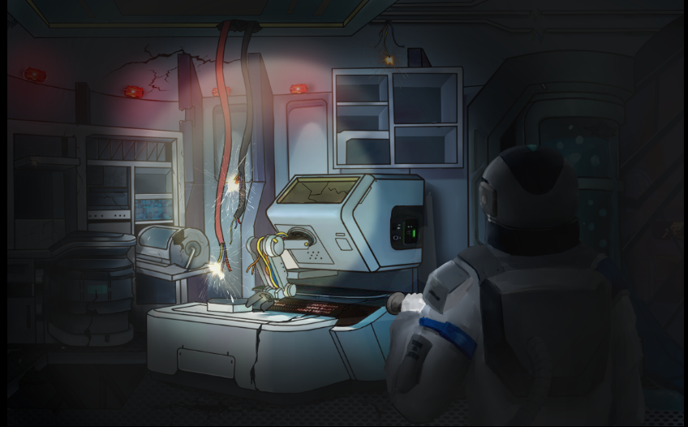
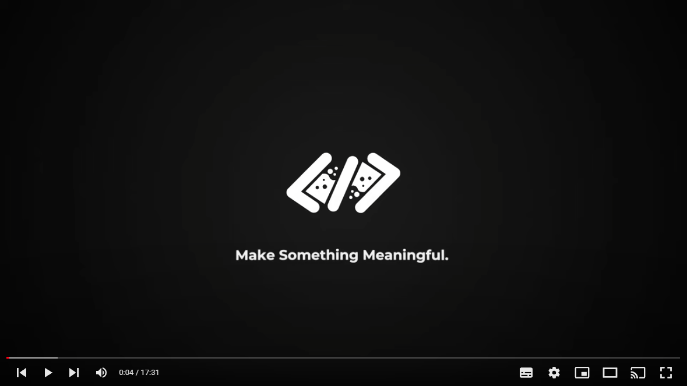
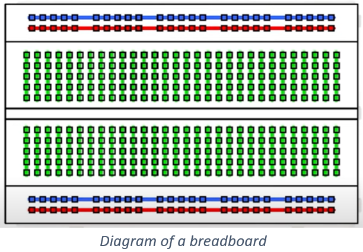

# Day 02 - "It's Really Dark In Here..."

<p align="center">
    <br>
    <i>We need some light in this place!</i>
</p>

## The Story So Far..
Now you have succeeded in starting up your Hero controller, the next step is to learn how to turn the lights on in your shuttle and to control various functions onboard. You will develop some knowledge both of analog circuits and the digital computer control that's provided to you by your Hero.

[](https://www.youtube.com/watch?v=0IulLD1Q1ZM&list=PL-ykYLZSERMSZFH8_4zQx4BMWpt4aG1kr)

## Day 02 Activity
You learn about the breadboard which is used to quickly and easily assemble analog circuits which are made up of discreet components such as LEDs, resistors and wires. You learn about voltage (or potential) and resistance. You make a circuit that includes an LED and protective 220 ohm resistor. At the start of the code, you define the integer variables Light and Internal which link the output variables to their pins. In the setup() function, you use pinMode() function to set up two pins as output, and the digitalWrite() function to set these outputs to LOW or HIGH. In the loop() function you use the digitalWrite() function to set the outputs to LOW and HIGH, and the delay() function to affect how long these states should remain before the program continues. This loop causes the output LEDs to blink on and off. You compile and upload the sketch to the Hero board which is connected to the breadboard. You then modify the code to change the amount of time that the LED is expected to be on and off.

## Wiring Diagram
| HERO | Component |
| --- | --- |
| 12 | LED long wire |
| GND | LED short wire |

## Fritzing Diagram
<i>[(Click here for full size image)](Day2.png)</i>


## Code Used

<i>[Click here for Day2.ino sketch](Day2.ino) - (Note that this is not the completed version of the code)</i>

```
  int Light = 12; // The HERO Board Pin that the LED is wired to

  void setup() {
    // initialize digital pin LED_BUILTIN as an output.
    pinMode(Light, OUTPUT);
    digitalWrite(Light, HIGH);
  }

```

## Installation
No libraries or includes required.

---
## <center><b>Key Learning for Day 2</b></center>
---
| Key learning introduced in Day 2 | Example of code / Further instructions|
| :--- | :--- |
| We were introduced to the [Breadboard](Breadboard.png) which is designed to allow you to quickly and easily assemble analog circuits which are made up of discreet components such as LEDs, resistors and wires|See [Video: Breadboards: Explained for more information on the breadboard](https://www.youtube.com/watch?v=hRxKkiZvRvA) |
| On the breadboard, it is worth noting that the ‘+’ & ‘-‘  strips on our breadboards may be the other way round when compared to those shown in the circuit diagrams and on the video. The ‘-‘ symbol indicates ground. The ‘+’ symbol indicates a positive voltage| TIP: If it is difficult to insert the component into the breadboard, try widening the hole by first inserting the end of a piece of wire first and then removing it.|
|We learned about voltage (or potential), electric current (sometimes referred to as amperage in the US) and resistance. Voltage in a circuit provides a ‘pressure’ for the electric current to flow. The relationship between these values is V=I*R, or rearranged to work out current: Current(I) = Voltage(V)/Resistance(R) |Voltage(V) is measured in Volts (V) <br> Current(I) is measured in Amperes (A) <br>Resistance(R) is measured in Ohms (Ω) |
| We learned that a Light Emitting Diode (LED) converts electrical energy into light. The longer prong on the LED needs to be connected to the higher voltage side (5V) in the circuit. The shorter prong should be connected to the lower voltage, or 0V.| |
|We learned the importance of using a 220 ohm resistor in series with the LED (Light Emitting Diode) to protect the LED from the flow of too much current through it. |Using the relationship Current = Voltage/Resistance,
The current through our circuit is = 5/220 = 0.023A, which is the right amount to light our LED. |
|We created a sketch in the code window to cause a light to blink on the breadboard and a blinking light on the Hero | |
|The code has a particular structure or syntax that is understood by the Hero. It consists of statements which end with a semi-colon “;” and these are sometimes grouped together inside curly brackets “{..}” |See [Day 2 code]((Day2.ino)) to check this out.<br>A statement is a line of code commanding a task. |
|We defined 2 [integer variables](https://www.arduino.cc/reference/en/language/variables/data-types/int/) at the top of our code using a statement at the beginning of the program and used them to identify which pins on the Hero board are of interest in this project. |int Light = 12 ;<br> (This defines “Light” as an integer which takes the value 12, the pin on the Hero board that the LED is connected to).|
---

## Extra Resources

See [Video: Breadboards: Explained for more information on the breadboard](https://www.youtube.com/watch?v=hRxKkiZvRvA)
<p align="center">
    <br>
</p>