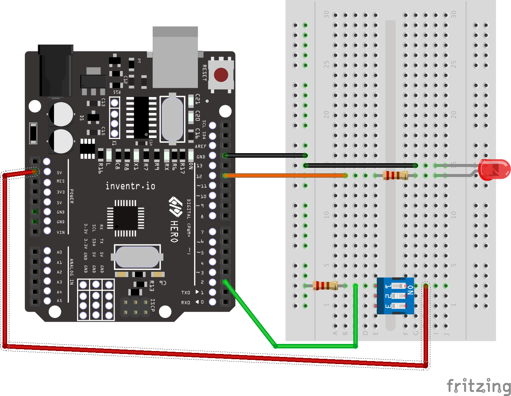
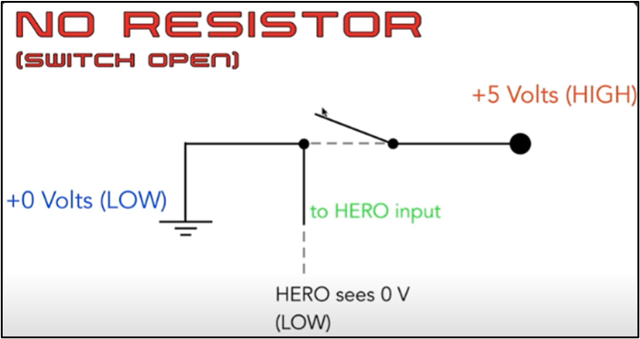
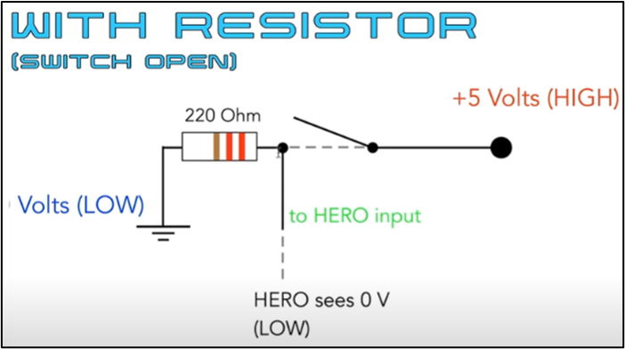
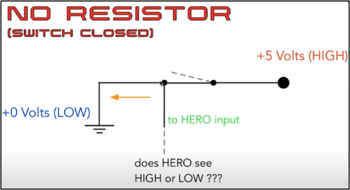
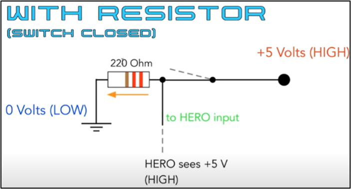

# Day 03 - "I'm Worried About Your Battery Levels"

<p align="center">
    <br>
    <i>These switches will be useful to  control your lighting circuits</i>
</p>

## The Story So Far..
You've got your lights working, but you now need to be able to turn them on and off so you don't use up too much power. Today you will add a switch to your circuit and read the state of the switch as an input to your Hero controller.

[]( https://www.youtube.com/watch?v=bihCOrv26dY&list=PL-ykYLZSERMSZFH8_4zQx4BMWpt4aG1kr)

## Day 3 Activity
You add a DIP Switch and resistor to your breadboard. At the start of the program, you define 2 integer variables and use them to identify which pins will be used in our circuit. In the setup() function, you use pinMode() function to set up pins as INPUT and OUTPUT. In the loop() function, you use digitalRead() function to determine the value of an input pin. You write a conditional test (if.. else) that will operate some instructions based on the result of the test. You use digitalWrite() function to set these outputs to LOW or HIGH, and the delay() function to affect how long these states should remain before the program continued. The continuous loop means that the LEDs will flash on and off repeatedly. You compile and upload the sketch to the Hero board, which is connected to the breadboard. You modify the code to execute more instructions within the conditional loop.

## Wiring Diagram
| HERO | Component |
| --- | --- |
| 5V | DIP Switch 1 in |
| 2 | DIP Switch 1 out |
| 12 | LED long wire |
| GND | LED short wire |

## Fritzing Diagram
<i>[(Click here for full size image)](Day3.png)</i>




<span style="color:red">Special Note:</span> The LED is connected with its long leg on row 14 which is the positive side, the short leg is connected on row 15.

## Code Used

<i>[Click here for Day3.ino sketch](Day3.ino) - (Note that this is not the completed version of the code)</i>

```

  void setup() {
    pinMode(LED, OUTPUT);
    pinMode(Switch1, INPUT);
  }

  void loop() {
    if (digitalRead(Switch1) == 1){
      digitalWrite(LED, HIGH); // 5V  
    }
    else {
      digitalWrite(LED, LOW); // GROUND
    }
  }

```

## Installation
No libraries or includes required.

---
## <center><b>Key Learning for Day 3</b></center>
---
| Key learning introduced in Day 3 | Example of code / Further instructions|
| :--- | :--- |
| We used a DIP (Dual Inline Packet) switch to control an output. | You can find out more about them on [Wikipedia](https://en.wikipedia.org/wiki/DIP_switch) |
| We learned that a resistor is necessary to set voltage to be HIGH or LOW when using a switch | Find out more in the [notes](#notes) below |
| We used one of the side strips on the breadboard for ground connection (if the side strips are colored on your breadboard, use the blue one for the ground connection, the red strip for the positive voltage). This makes it possible to connect several circuits to ground or 0V. |  |
| We used pinMode() function to set a pin as [INPUT](https://www.arduino.cc/reference/en/language/variables/constants/constants/). This is used within the setup() function. | pinMode(Switch1, INPUT); |
| We used [digitalRead() function](https://www.arduino.cc/reference/en/language/functions/digital-io/digitalread/) to determine the state of the digital input pin. This is used within the loop() function. | digitalRead(Switch1)==HIGH; |
| We wrote a conditional test that will operate some instructions based on the result of the test. This is used within the loop() function. ‘==’ means ‘is equal to’ | if (digitalRead(Switch1)==HIGH) { <br>&nbsp;&nbsp;// perform the commands in this section if the value of Switch1 is HIGH <br>} <br> else{ <br>&nbsp;&nbsp;// otherwise perform the commands in this section <br> } |
---

## Notes

It is important to use a resistor to set voltage LOW or HIGH when using a switch. These diagrams should help to explain why:

<p align="center">
    
    
</p>