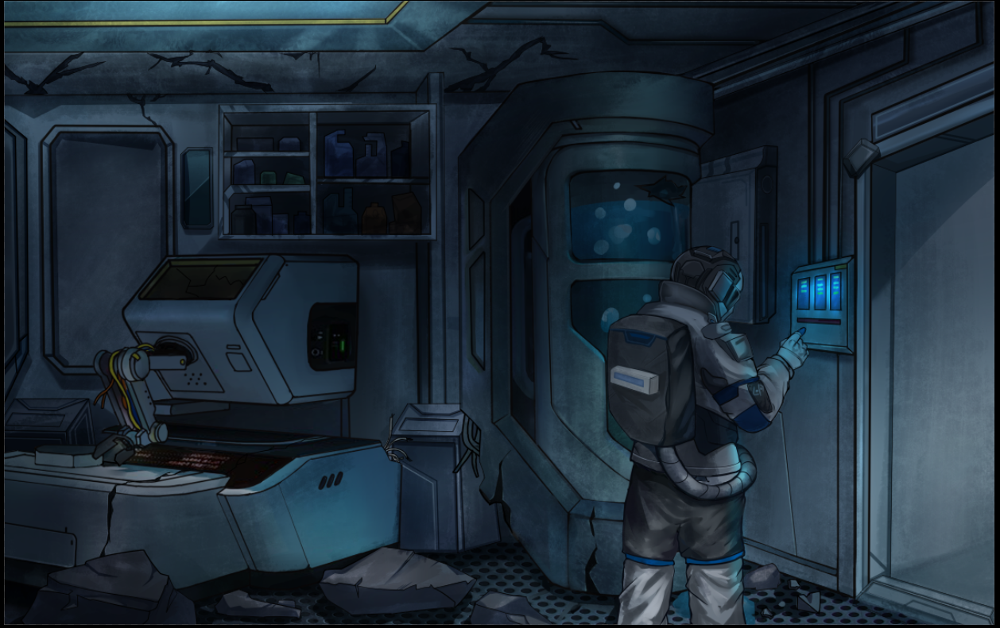

# Day 04 – “Cabin Lighting”

<p align="center">
    <br>
    <i>We now want to control more lights!</i>
</p>

## The Story So Far..
You now have to be able to control lights in other parts of your shuttle, so you will add more lights to your system and learn how to control them with the 3 switches of your DIP switch.

[]( https://www.youtube.com/watch?v=EpsJpYL1XZA&list=PL-ykYLZSERMSZFH8_4zQx4BMWpt4aG1kr&t=2s)

## Day 04 Activity
We added two more LEDs to the circuit from Day 3, and two more resistors to the breadboard so that we could use the DIP Switch to control 3 outputs. At the start of the code, we defined 6 integer variables that were used to identify which pins would be used in our circuit. In the setup() function, we used the pinMode() function to set up pins as INPUT and OUTPUT. In the loop() function, we used a conditional test that was based on the 3 inputs to turn the 3 LEDs on or off. Switch1 turned LED1 on and off, Switch2 turned LED2 on and off, Switch3 turned LED3 on and off. We compiled and uploaded the sketch and tested it out by using the three switches to turn our LEDs on and off.

## Wiring Diagram:
| HERO | Component |
| --- | --- |
| 5V | Breadboard +ve rail |
| 2 | DIP Switch 1 out |
| 3 | DIP Switch 2 out |
| 4 | DIP Switch 3 out |
| 10 | Red LED long wire |
| 11 | Blue LED long wire |
| 12 | Green LED long wire |
| GND | Breadboard -ve rail |

## Fritzing Diagram
<i>[(Click here for full size image)](Day4.jpg)</i>


## Code Used

<i>[Click here for Day4.ino sketch](Day4.ino) – (Note that this is not the completed version of the code)</i>

```

 void setup() {
  // initialize digital pin LED_BUILTIN as an output.
  pinMode(Light1, OUTPUT);
  pinMode(Light2, OUTPUT);
  pinMode(Light3, OUTPUT);
  pinMode(SWITCH1, INPUT);
  pinMode(SWITCH2, INPUT);
  pinMode(SWITCH3, INPUT);
}

```

## Installation
No libraries or includes required.


---
## <center><b>Key Learning for Day 4</b></center>
---
| Key learning introduced in Day 4 | Example of code / Further instructions|
| :--- | :--- |
| We used the DIP switch as 3 inputs to control 3 outputs |  |
| We used a conditional test based on the state of the 3 switches |  |
---
