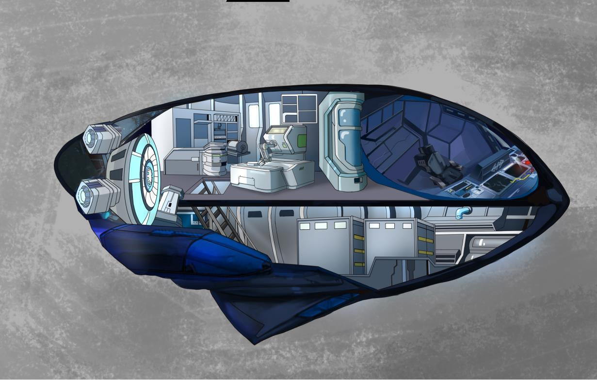
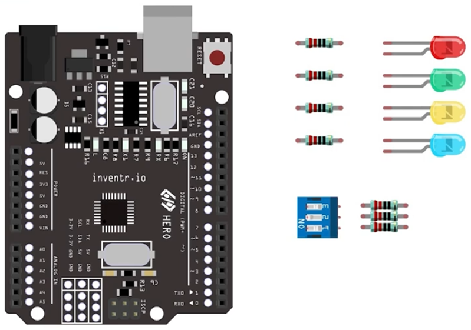

# Day 05: Creative Day #1

     
    <i>The choice is yours – What will you work on today?</i>

## The Story So Far..
Today is an opportunity to think about what you have learned so far and work on a design of your own. You can share your project on the [Facebook community group](https://www.facebook.com/groups/inventrkits) which is a very supportive and encouraging.

## Summary of Learning

Days 1-4
-	How to illuminate LED lights as well as the on-board light
-	How to run repetitive programs (loops) in our code
-	How to control things according to time using delay functions
-	How to use a switch as an input to the HERO to control an output
-	How to use 3 inputs to control 3 outputs

**The general format of the sketch programming we have learned so far is as follows:**
-	At the start of the program, define the integer variables and use them to identify which pins will be used in your circuit.
-	In the setup() function, use pinMode() function to set up pins as INPUT and OUTPUT.
-	In the loop() function:
o	use digitalRead() function to determine the value of an input pin, 
o	use digitalWrite() function to set these outputs to LOW or HIGH, 
o	use delay() function to affect how long these states should remain before the program continues.
o	Use conditional testing to introduce some choices in the program based on the inputs

Special Note:
Pins 0 and 1 are used for communication with the computer. Connecting anything to these pins can interfere with that communication, including causing failed uploads to the board. Pin 13 in connected to the built-in LED
## Components Available
Here are the components you have used so far:
-	HERO board
-	LEDs
-	DIP switch
-	220 ohm resistors

<i>[(Click here for full size image)](Day5.png)</i>

## Some Suggestions to Consider
Here are a few ideas to start you thinking about what you can create:
-	Arrange your LEDs on the breadboard in a geometric pattern and have them flash in some particular pattern
-	Use combinations of the three switches to control a number of lights
-	Make your onboard LED flash out an SOS message – you need some help!
-	Make an LED chaser so that the LED lights turn on one after another up and down the row
-	Program your LEDs to work like a traffic light
-	Program your LEDs to flash like a metronome, use your switch to change the bpm (beats per minute)

