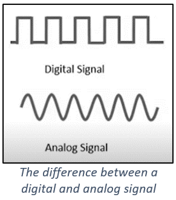

# Day 06 – “Time to Fix the Battery”

<p align="center">
    <br>
    <i>You need to get some power to this ship!
    </i>
</p>

## The Story So Far..
Now you are using power for lighting up your shuttle, the next priority is to be able to recharge your batteries. You will discover a new component called a photoresistor which responds to the light that is falling on it. You will also learn how to read analog values and write an output to your serial monitor.

[]( https://www.youtube.com/watch?v=8dZ3M9ePki4&list=PL-ykYLZSERMSZFH8_4zQx4BMWpt4aG1kr)

## Day 6 Activity
After learning about the serial monitor, the photoresistor and analog pins, you build a new circuit on the breadboard to include a photoresistor and 220 ohm resistor. Next, you write out the code that will read the analog pins connected to the photoresistor and write out the value to the serial monitor. At the start of the code, you declare 3 integer variables to show that you will be using the A0 pin, the onboard LED and a variable to contain the value of the light levels – setting it initially to zero. In the setup() function, you open the serial communication line and determine the speed of this communication. You also use the pinMode command to set the onboard LED as an output. In the loop() function you make the sensorValue variable equal to the value on the A0 input pin, and make the onboard LED flash on and off and the length of the flash equal to the value of sensorValue. This value is also printed to the serial monitor.  You compile and upload the sketch onto the HERO and test out the program. When light is prevented from falling on the photoresistor, the reading displayed on the serial monitor is low. When a torch is shone on the photoresistor, the sensorValue is high.

## Wiring Diagram:
| HERO | Component |
| --- | --- |
| 5V | Photoresistor in |
| A0 | Photoresistor out |
| GND | Photoresistor out (220&Omega;) |

## Fritzing Diagram
<i>[(Click here for full size image)](Day6.png)</i>


## Code Used

<i>[Click here for Day6.ino sketch](Day6.ino) – (Note that this is not the completed version of the code)</i>

```

  void loop() {
    sensorValue = analogRead(sensorPin);
    digitalWrite(onboardLED, HIGH);
    delay(sensorValue);
    digitalWrite(onboardLED, LOW);
    delay(sensorValue);
    Serial.println(sensorValue);
    delay(500);
  }

```

## Installation
No libraries or includes required.


---
## <center><b>Key Learning for Day 6</b></center>
---
| Key learning introduced in Day 6 | Example of code / Further instructions|
| :--- | :--- |
| The serial monitor window can be opened using the icon on the top right-hand side of the screen in the Arduino IDE. The [Serial communication line](https://www.arduino.cc/reference/en/language/functions/communication/serial/) can be opened by a command in the setup(). 9600 represents the speed of communication in bits per second.| Serial.begin(9600); // This opens communication with the serial monitor. Note that the serial monitor must still be opened using the icon on the top right-hand side of the monitor to view it. Note that if you open the serial monitor when the code is running, the code will start again. |
| We learned how to print text to the serial monitor. Note that [Serial.print()](https://www.arduino.cc/reference/en/language/functions/communication/serial/print/) is also used to print to the serial monitor. [Serial.println()](https://www.arduino.cc/reference/en/language/functions/communication/serial/println/) moves the cursor down a line, and so acts like a carriage return. | Serial.println("Hello Earthling"); |
| Pins A0 - A5 are analog input pins which are sensitive to analog input which is a varying voltage input between the value of 0 and 5V. They convert this to a value between 0 and 1023 (this is 1024 integer values if you include 0) depending on the value of the voltage. This is different from digital pins which only identify 0 or 5 V (Low or High) or (on and off). (See the additional notes below for a diagram to show the difference between an analog and digital signal) |  Here are some examples of how the voltage is converted to a value:<br> &nbsp;&nbsp;&nbsp;0V -> 0 <br> 2.5V -> 511   (half of the highest value) <br> &nbsp;&nbsp;&nbsp;5V -> 1023 <br> (You can find further explanation of this on the [analogRead()](https://www.arduino.cc/reference/en/language/functions/analog-io/analogread/) section of the Arduino website |
| We set up an integer variable called sensorValue which is used to store the value reading from the sensor and set it to an initial value. | int sensorValue = 0; // ‘=’ sets the value to something |
| A photoresistor (or light dependent resistor - LDR) has a resistance which is dependent on the light which is falling on it. It has a very high resistance when it is in the dark, but when light falls on it, it has a small resistance, about 200 ohms. This means that the voltage drop across the photoresistor varies as the light level changes. There is a greater drop in voltage across it when it is dark, because the resistance is higher. | The measurement from the photoresistor is between 0-1023 dependent on the level of light that falls on it. |
| The [analogRead()](https://www.arduino.cc/reference/en/language/functions/analog-io/analogread/) function will return a value based on the voltage of the pin | sensorValue = analogRead(sensorPin); |
| We tested the value read on A0 by attaching it to 5V, GND and then the location between the photoresistor and other the resistor. We saw the effect of changing the light level to this by covering over the photoresistor. |  |
| We used the sensorValue to affect the blinking frequency of the onboard LED | void loop() { <br>  &nbsp;&nbsp; digitalWrite(onboardLED, HIGH); <br> &nbsp;&nbsp; delay(sensorValue);  <br> &nbsp;&nbsp; digitalWrite(onboardLED, LOW);  <br> &nbsp;&nbsp; delay(sensorValue); <br> }  |
---

## Additional Notes

