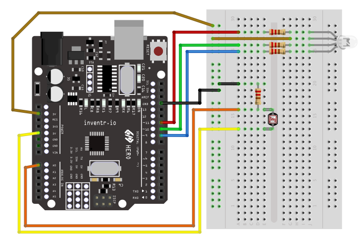

# Day 8 - "Adding Some Color To This Dark Place"

[](https://www.youtube.com/watch?v=0IulLD1Q1ZM&list=PL-ykYLZSERMSZFH8_4zQx4BMWpt4aG1kr&index=8)

## Story Synopsis:

Placeholder example: After Just getting your power systems back online and a light to see again, you need to look for a way to save that last bit of remaining battery power remaining until you can deploy the solar panels.... or else it's game over!:

Comic-Style Graphic:


```
void loop() {
  RGB_color(125, 0, 0); // Red
  delay(500);
  RGB_color(0, 125, 0); // Green
  delay(500);
  RGB_color(0, 0, 125); // Blue
  delay(500);
  RGB_color(0, 125, 125); // yellow
  delay(500);
  RGB_color(125, 0, 125); // purple
  delay(500);
  RGB_color(125, 125, 125); // white
  delay(500);
}
```

### Wiring Diagram:
| Arduino | RGB_LED |
| --- | --- |
| 9 | Blue |
| 10 | Green |
| 11 | Red |
| GND | Ground |

Version 1:


Version 2:


### Installation
No libraries or includes required.
