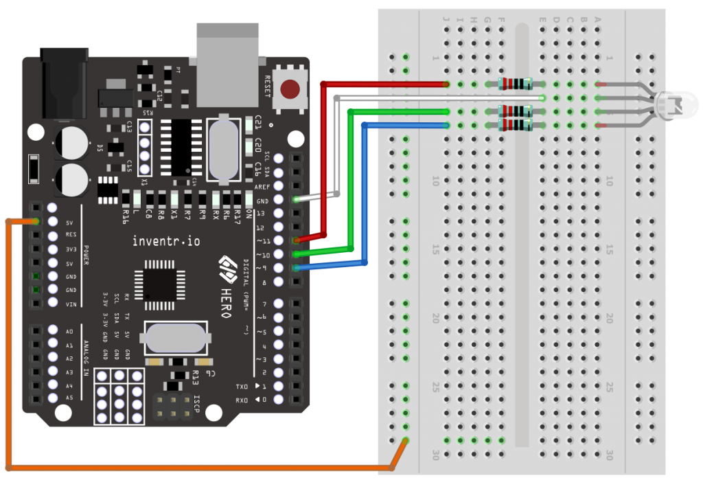

# Day 08 – “Adding some color to this dark place”

<p align="center">
    <br>
    <i>Let's get a better picture of how your  battery is charging</i>
</p>

## The Story So Far..
Greetings from Rescue Shuttle Control! You've been doing a great job of both collecting data and controlling circuits using the logic in your Hero board. In our last session, we sent information through the serial monitor. Today, we are going to communicate information through the LEDs. In particular, we are going to use a new component called a RGB LED which can be controlled to give us a range of colors using a special function called Pulse Width Modulation, or PMW for short. This might be useful in creating a visual display to show the level of your battery charge.

[]( https://www.youtube.com/watch?v=1r00NsGKsJw&list=PL-ykYLZSERMSZFH8_4zQx4BMWpt4aG1kr&index=10)

## Day 8 Activity
We learned about the RGB LED and connected it up in a circuit with 3 resistors to protect each colored LED. We tested each color by connecting it in a circuit to the 5V source. We also combined the colored LEDs to see the resulting color. At the start of our code, we declared 3 integer variables to identify the pin number corresponding to our 3 colored LEDs. In the setup() routine, we use the pinMode() function to set each of the pins as OUTPUTs. We wrote a custom function called RGB_color to define the amount of on and off each color channel needs. This takes 3 input values and activate the pins with the appropriate duration – which is using Pulse Width Modulation (PWM). On our HERO board, we can see that pins 3, 5, 6, 9, 10 and 11 are labelled to show that they can be used for PWM. The RGB_color() function calls the analogWrite() for each of the colored pins to set them up with the values we have set the red, green and blue values elsewhere in the code.
We copied the code in the loop() function which called the RGB_color() function several times, passing it the values of the red, green and blue values which would be used to light up the RGB LED. In between the call of the RGB_color() function, we inserted the delay() function to give us a chance to see the RGB LED changing color. We compiled the code and uploaded the sketch to the HERO board and could watch the sequence of color flashes that we set up in the code. We are then invited to change the values given to the RGB_color() function to test out our understanding of how this code works with the display of different colors in the RGB LED.

## Wiring Diagram:
This is used for a standard RGB LED

| HERO | Component |
| --- | --- |
| 5V | Breadboard +ve rail |
| 9 | RGB LED red wire (220/Omega) |
| 10 | RGB LED green wire (220/Omega) |
| 11 | RGB LED blue wire (220/Omega) |
| GND | RGB LED longest wire |

## Fritzing Diagram
<i>[(Click here for full size image)](Day8.png)</i>



* <span style="color:red">Special Note:</span>: The orange wire that connects 5V to the red strip on the breadboard is useful when we test out the individual colors within the RGB LED. This is not needed for the program we upload onto the HERO board.*

## Code Used

<i>[Click here for Day8.ino sketch](Day8.ino) – (Note that this is not the completed version of the code)</i>

```

void loop() {
  RGB_color(125, 0, 0); // Red
  delay(500);
  RGB_color(0, 125, 0); // Green
  delay(500);
  RGB_color(0, 0, 125); // Blue
  delay(500);
  RGB_color(0, 125, 125); // yellow
  delay(500);
  RGB_color(125, 0, 125); // purple
  delay(500);
  RGB_color(125, 125, 125); // white
  delay(500);
}

```

## Installation
No libraries or includes required.


---
## <center><b>Key Learning for Day 8</b></center>
---
| Key learning introduced in Day 8 | Example of code / Further instructions|
| :--- | :--- |
| We were introduced to the three-color LED, otherwise known as the RGB LED (Red Green Blue). Like a standard LED, each lead requires a limiting 220 ohm resistor. | The 2nd from the left lead is the longest lead of the LED should be attached to the Ground. The 1st lead is the red LED, the 3rd lead is the green LED, and the 4th leg is the blue LED. |
| We learned how to command a digital output with an analog command, analogWrite(). Although we cannot change the level of output voltage on a digital output, we can change how long it is on or off for. The value we use to determine the amount of light for each color is between 0 and 255. (Note that 8 bits are used to hold this information, and 28 = 255) <br> 255 = Keep this on all the time. <br> 0 = Keep this off all the time. <br> If it is in between, 128, this means it is on half of the time and off for half of the time. <br> This is called [Pulse Width Modulation (PWM)](https://docs.arduino.cc/learn/microcontrollers/analog-output) | We cannot see the flashing because the frequency is too fast, however, the brightness will change. <br><br> analogWrite(red, red_value); <br> analogWrite(green, green_value); <br> analogWrite(blue, blue_value);|
| We created a custom function called RGB_color which contained the analogWrite commands (see above). The values in the brackets correspond to the variables that are passed to it from the loop() function which calls it | void RGB_color(int red_value, int green_value, int blue_value) <br> { <br> &nbsp;&nbsp;  // the analogWrite commands go here <br> } |
| In the loop() function, we called the custom RGB_color() function that we had created and sent it different values to be used in the analogWrite commands that were contained in it. <br> The delay() function is used to pause the program so that we have a chance to see each color being displayed.  | RGB_color(125, 0, 0); // Red color <br> RGB_color(0, 125, 0); // Green color <br> RGB_color(0, 0, 125); // Blue color <br> RGB_color(64, 32, 0); // Yellow color <br> RGB_color(125, 0 ,125); // Purple color <br> RGB_color(125, 125, 125); // White color <br> (These work equally well with a maximum value of 255) |
---

