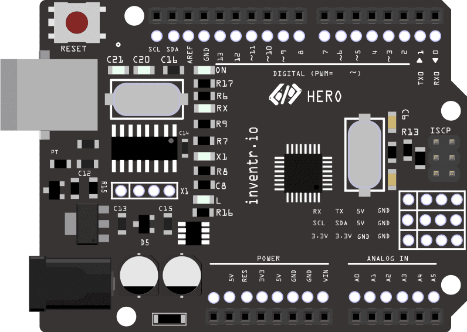

# ["InventrKits: 30 Days Lost in Space Adventure Kit"](https://www.inventr.io/sale)

<center><i>Your 30 Day Coding And Circuits Challenge To Bring You From Beginner To Builder</i></center>

## Story Synopsis:

"We’re sorry to say it, but you seem to have crashed on some alien planet. Did you not see it on your radar? Whelp no worries, we’ve dealt with this situation thousands of times. We know this may sound overwhelming, but you need to learn to code and wire so you can fix your destroyed control panel. 

While you’re at it, we detected a few other “minor ” repairs you will need to complete. Your solar panel is offline, the air ballast system has failed, your security systems aren’t working, and the worst problem of all, your entertainment system is down.

Again, nothing to stress out over, it’s all fixable with the right tools and training. This repair kit has an excellent success rate and will walk you step by step through each repair mission.

It will take you exactly thirty days to repair your shuttle and we will guide you through all the steps necessary, from coding to wiring up your fancy new hardware setup.

Starting with those silly lights, it’s kind of hard to fix complex systems if you can’t see them. Then we will work all the way to getting your shuttle out of the water and off this backward planet!"


```
// the setup function runs once when you press reset or power the board
void setup() {
  // initialize digital pin LED_BUILTIN as an output.
  pinMode(LED_BUILTIN, OUTPUT);
}

// the loop function runs over and over again forever
void loop() {
  digitalWrite(LED_BUILTIN, HIGH);   // turn the LED on (HIGH is the voltage level)
  delay(1000);                       // wait for a second
  digitalWrite(LED_BUILTIN, LOW);    // turn the LED off by making the voltage LOW
  delay(1000);                       // wait for a second
}
```



### Installation
All required libraries can be found at [inventr.io/libraries](https://www.inventr.io/libraries)
