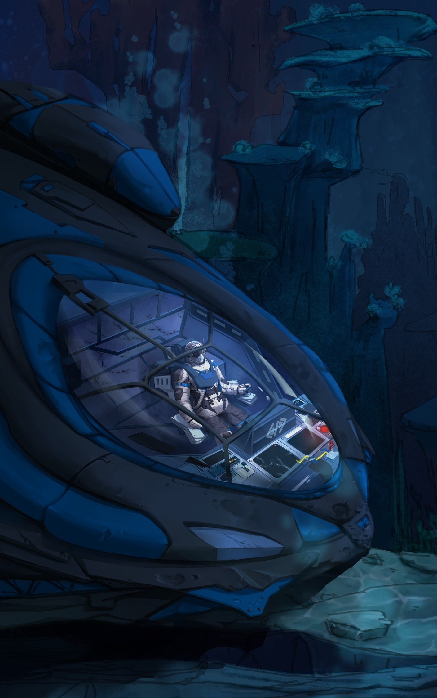

# [InventrKits: 30 Days Lost in Space Adventure Kit](https://www.inventr.io/sale)

*Your 30 Day Coding And Circuits Challenge To Bring You From Beginner To Builder*

## Story Synopsis:

Explorer?  Explorer?  This is your ship's AI companion, NAME, in the orbiting mother ship.  I was watching your landing from orbit here and it appears from here that something went drastically wrong as you approached the landing zone.  Are you all right?

Ah, good!  I'm so glad you survived with no injuries.  According to the ship's telemetry here it appears that your landing shuttle's computer suffered a catastrophic failure shortly before you were due to land.  After your computer failed the shuttle over-shot it's intended landing spot but luckly struck the surface of a nearby sea and is currently resting on the bottom, not too far from the surface.

I took it upon myself to run a complete diagnostic and have determined that the ship's computer suffered a catastrophic failure as we approached our targetted landing zone causing the hard landing.  Luckily, we hit the ocean surface rather than land, but it also means we're currently on the sea bottom.

Other than the ship's computer I detect little damage.  But since the ship's systems are all operated by the ship's computer not much is currently working.

Good news, we have a repair kit on board.  Bad news, it appears to be a *bit* out of date and the technology is quite old.  However, the HERO board in the repair kit should be more than capable of operating enough of the shuttle's systems once we program it and connect it to the shuttle systems.

I'm sure that with my help you'll be able to restore the ship's systems, successfully launch this ship and return home safely.

Shall we begin?